# Final Project Results: Layer 1 EWMA Baseline and Layer 2 GARCH Extension

## Executive Summary

This report combines the full Layer 1 baseline backtest with the Layer 2 GARCH timing extension for the USO short-volatility strategy. The main result is that timing quality matters more than raw short-vol exposure, and the initial GARCH timing implementation materially outperformed the EWMA benchmark in this sample.

The baseline Layer 1 result established that unconditional short-volatility selling performed poorly, daily hedging alone did not improve outcomes, and the EWMA timing filter was the primary source of improvement. Layer 2 then replaced the EWMA timing forecast with a rolling GARCH(1,1) forecast while keeping the rest of the backtest framework intact. In the first pass, the hedged GARCH strategy with stop loss produced the strongest performance across all tested methods.

## Layer 1 Summary Table

| strategy | num_trades | total_pnl | sharpe | max_drawdown_$ | win_rate_% |
| --- | --- | --- | --- | --- | --- |
| A_no_hedge_uncond | 74 | -2378.00 | -0.28 | -5068.50 | 67.57 |
| B_hedge_uncond | 74 | -4960.57 | -0.33 | -8643.46 | 64.86 |
| C_no_hedge_ewma | 58 | -104.00 | -0.01 | -4699.50 | 65.52 |
| D_hedge_ewma_stop | 58 | 557.02 | 0.05 | -4858.64 | 58.62 |

## Layer 2 Summary Table

| strategy | num_trades | total_pnl | sharpe | max_drawdown_$ | win_rate_% |
| --- | --- | --- | --- | --- | --- |
| D_hedge_ewma_stop | 58 | 557.02 | 0.05 | -4858.64 | 58.62 |
| E_no_hedge_garch | 47 | 1586.50 | 0.22 | -3621.00 | 76.60 |
| F_hedge_garch_stop | 47 | 4987.24 | 0.53 | -2359.76 | 70.21 |

## Layer 1 Charts

### Underlying Price

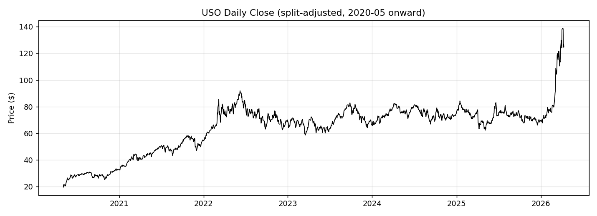

### EWMA Realized Volatility

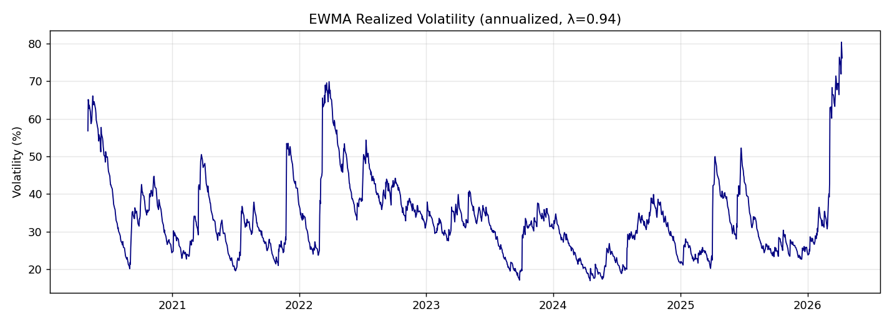

### Implied Volatility vs EWMA

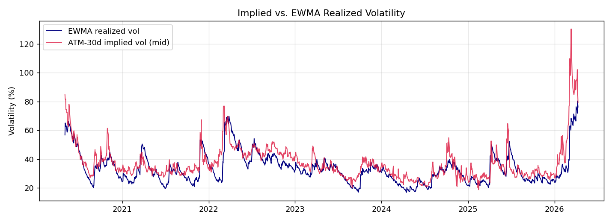

### Layer 1 Cumulative P&L

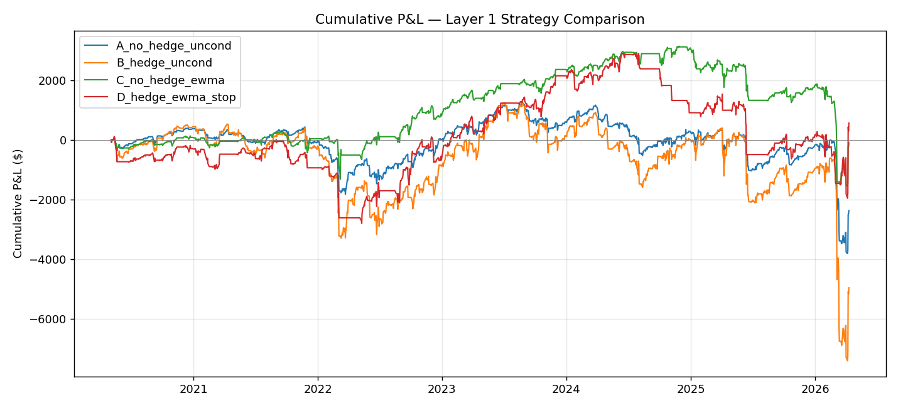

### Layer 1 Drawdown

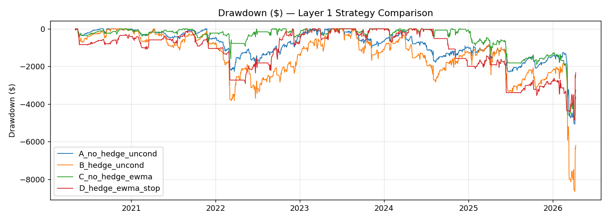

### Layer 1 Trade P&L Distributions

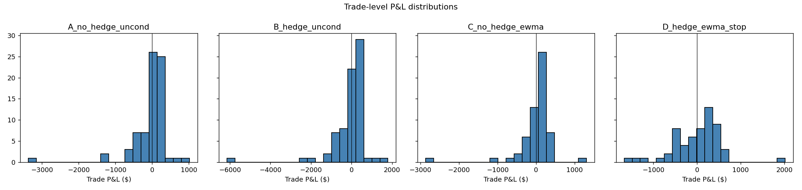

### Hedged vs Unhedged Comparisons

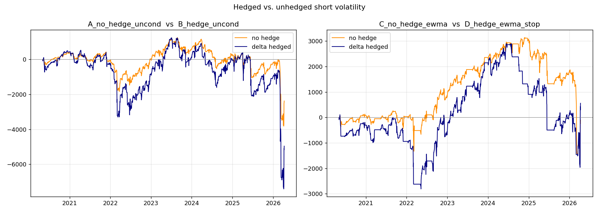

## Layer 2 Charts

### Forecast Comparison: IV vs EWMA vs GARCH

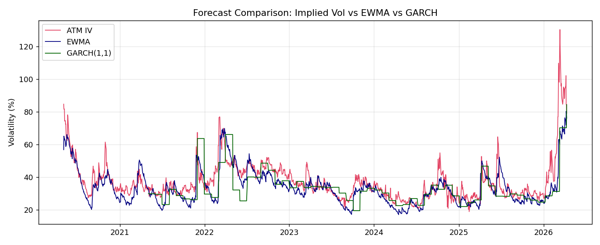

### All Methods: Cumulative P&L

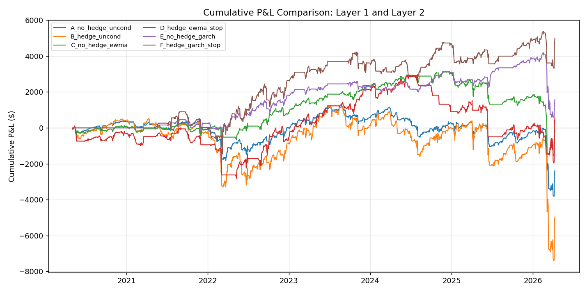

### All Methods: Drawdown

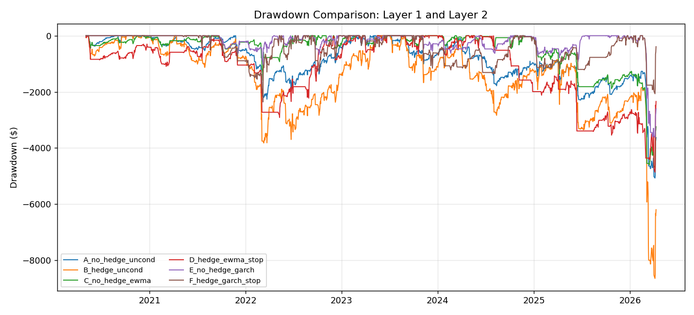

### All Methods: Trade-Level P&L

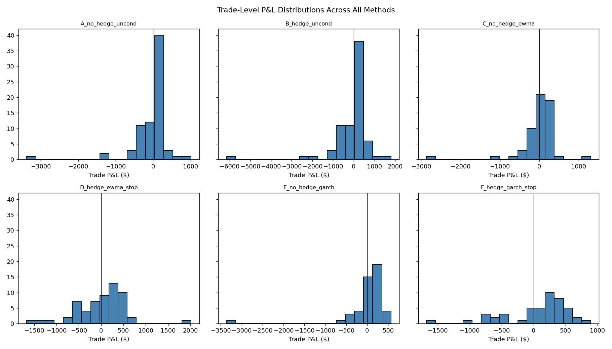

### Layer 2 Strategy Comparison

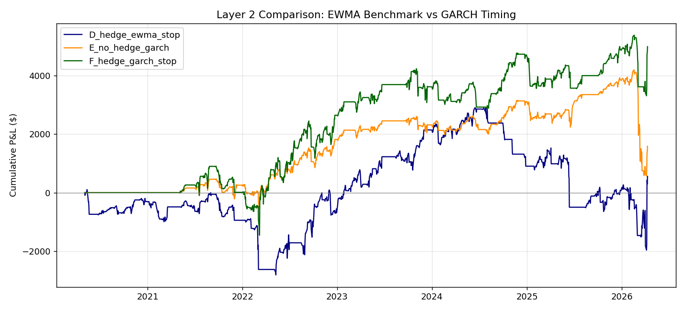

## Analysis

### 1. What Layer 1 proved

Layer 1 showed that unconditional short-volatility selling was not attractive in this sample. Strategy A lost money, and Strategy B performed even worse, which suggests that hedging alone did not create edge. The main improvement came from timing: Strategy C dramatically reduced losses relative to A, and Strategy D added a modestly positive total P&L and the only positive Sharpe among the Layer 1 set.

The implication is that the project should not be framed as “hedging fixes the strategy.” A more accurate interpretation is that timing is the main source of edge, while hedging and stop-loss logic help make the timed strategy more robust.

### 2. What changed in Layer 2

The Layer 2 extension kept the same backtest engine, option selection, holding period, hedge mechanics, and stop-loss logic. The key change was the volatility forecast used for trade entry. EWMA is a fixed-rule exponential smoother of recent realized volatility, while GARCH is a fitted rolling forecast designed to capture volatility clustering and persistence more explicitly.

In practical terms, both methods still use the same decision rule structure:

- enter only when implied volatility is sufficiently above forecasted realized volatility

But the forecast itself changes from EWMA to GARCH. That means Layer 2 is a cleaner model-comparison experiment rather than a wholesale redesign of the strategy.

### 3. What the first GARCH results suggest

The first GARCH pass was materially stronger than the EWMA benchmark. Strategy E, which used GARCH timing without hedge, outperformed the Layer 1 no-hedge timed strategy C by a wide margin. Strategy F, which combined GARCH timing with hedge and stop-loss controls, produced the strongest total P&L, strongest Sharpe, and shallowest drawdown of the compared timed strategies.

This suggests that the GARCH forecast filtered entries more effectively than EWMA in this sample. It also reduced the number of trades from 58 to 47, which is consistent with a more selective timing model.

### 4. Cautions and next steps

These Layer 2 results are promising, but they should still be treated as a first research result rather than a final production conclusion. The GARCH specification here is a simple rolling GARCH(1,1) with periodic refits. A fuller analysis should test sensitivity to:

- GARCH window length
- refit frequency
- alternative volatility models such as EGARCH or GJR-GARCH
- different IV-to-forecast thresholds
- stability across subperiods

The next strongest extension would be a robustness section showing whether the GARCH advantage persists under reasonable parameter changes rather than only in the default configuration.

## Conclusion

The combined evidence from Layer 1 and Layer 2 supports a clear storyline. Short-volatility selling without timing performs poorly. EWMA timing improves the baseline, but the initial GARCH timing implementation appears to improve it further, especially when combined with hedge and stop-loss controls. In the current sample, GARCH-based timing is the strongest candidate for the project’s Layer 2 improvement.
